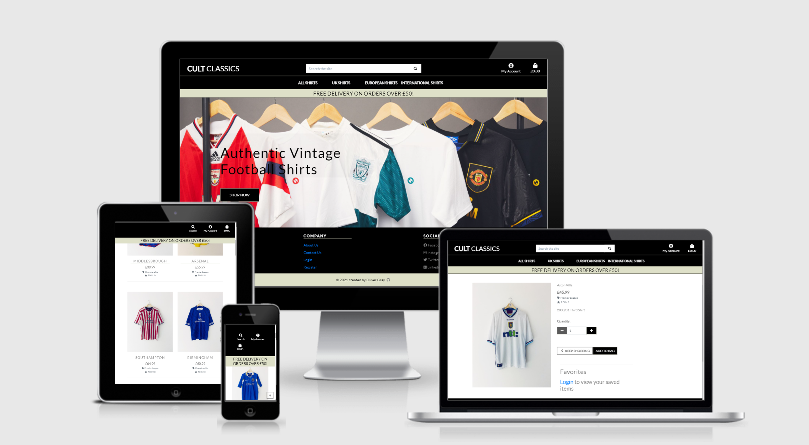
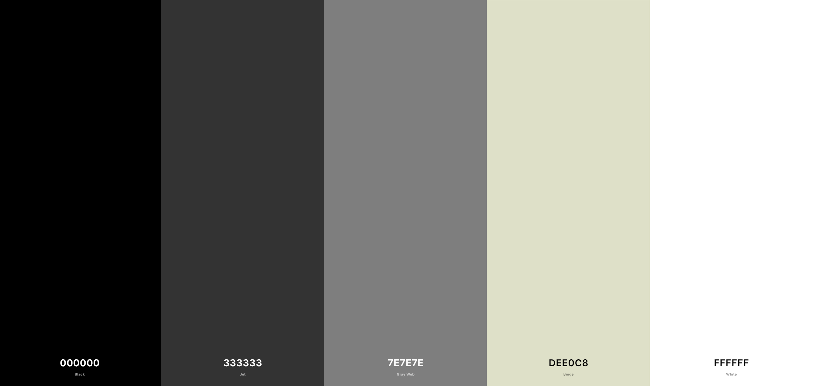

# Cult Classics

Cult Classics is an online shop, which sells authentic vintage football shirts. This project was built as the 4th Milestone Project for the Code Institute - Full Stack Developer Course.
**IMPORTANT (disclaimer): This project is meant for educational purposes only. Stripe's credit card payment functionality is real but remains in a "test mode" so that no payments will be taken. Please do not enter any personal credit/debit card numbers whilst using the site. This project contains real products from existing brands. If you want to make a test purchase on my site you can use the deteails below.
Test transaction details:

credit card: 4242 4242 4242 4242
expiration date: 04 / 24
CVC: 424
ZIP: 42424

The live site can be viewed [here]()

# Table of contents
1. [User Experience (UX)](#UX)
    1. [Strategy & Scope](#Strategy)
    2. [Features](#Structure)
    3. [Skeleton](#Skeleton)
    4. [Design/Surface](#Design)
2. [Information Architecture](#Database)
3. [Technologies](#TechnologiesUsed)
4. [Testing](#Testing)
5. [Deployment](#Deployment)
    1. [Local]()
    2. [Heroku]()
    3. [AWS]()
    4. [Stripe]()
6. [Credits](#Credits)
7. [Acknowledgements](#Acknowledgements)

# UX
## Strategy
### Project Goals
The goal of this project is to build a full stack Ecommerce website based around the market for reselling and collecting vintage and rare football shirts. The site will act a destination site for all potential buyers but also give users the opportunity to sell their shirts to the site owners. 

## User Stories
### Viewing and Navigation
 - As a first time user i would like to know what the website is offering so i can make a decision on whether i would like to continue using the site. 
 - As a first time user i would like to see easy to understand and use navigation to move around the site

### Registration and User Accounts
 - As a site user i would like to register an account to make future purchases easier. 
 - As a logged in user i would like to see a profile summary and all my previous order details. 
 - As a returning user i would like to save products to a wishlist so i can easily purchase at a later date. 
 - As a site user with an account i would like to easily log in and log in of my account. 

### Sorting and Searching
 - As a shopper i would like to view all the products available to buy on the site so i can browse options i may not have seen before. 
 - As a shopper i would like to narrow down the products on the site to a specific category so i can find a product quickly. 
 - As a shopper i would like to view the products in specific orders for example acending price order or decending rating order. 
 - As a shopper i would like to search for products using key words so i can quickly narrow down to a product i know i would like to purchase. 
 - As a shopper i would like to be able to add products i like to a favourites list to view at a later time. 

### Purchasing and Checkout
 - As a shopper i would like to be able to add items to a basket should i wish to make more than one purchase. 
 - As a shopper i would like to see live updates to the total cost of my basket so i can make a decision as to if i can purchase more. 
 - As a shopper i would like to be able to update my basket by further adding and removing products i have changed my mind on. 
 - As a shopper i would like to checkout and pay for my items securely. 
 - As a shopper i would like to see an order confirmation so i can validate my purchase. 

### Admin and Store Management 
 - As site admin i would like to be able to easily add, edit and remove products from the site so i can minimise process time. 
 - As site admin i would like to be able to view contact messages that have been sent in by site users and respond to them. 

# Structure
## Features 

### Base Template 
- Navigation Bar
    - The nav bar is split into two levels. The first level contains the business name/brand, a clickable link that will return the user to the home page from any page, a product search bar useful for returning users wanting to search/purchase a specific product, a register/login link and a bag icon that updates once users add items to their bag. 
    - The second Nav bar contains searchable links by category, useful for returning users.
- Navigation Bar - Mobile 
    - When used on mobile the nav bar condenses down to include the bag icon, account icon and a search icon with an interactive dropdown search box. 
- Footer
    - The footer contains clickable social media icons, useful for new users wanting to learn more about the business.
    - The footer also contains useful company links to login/register to the site, a link to an about us page and a link to a contact page, all useful for new interactive users.
    - The footer also contains useful quick category search links to the products page. 
- Toast Messages
    - Toast messages have been used throughout the site to give the user feedback on their actions, the messages are colour coded, Green for success, Yellow for warning, Blue for information and Red for an error.

### Home Page
- Home Page
    - The home page incorporates all of the above base template features additionally it simply features a large banner image, a specific product image to give a clear indication to the user what the sites purpose is. 
    - On top of this image a large "Shop now" button is displayed to draw the user into the product page. 

### Products
- Product Page 
    - In the top left of this page there is a product counter to indicate how many products are being shown depending on the search criteria. 
    - In the top right of this page there is a sorting selector so a customer can sort the products by price (high or low), rating (high or low), name (high or low) or category (high or low).
    - The page is responsive, displaying 4 products on extra large screens, 3 on large screens, 2 on medium and 1 on small screens. 
    - The products are displayed in a card format, a large image with small key informative information below like the price and rating. 

- Product Detail page 
    - The product detail page shows the product image as a large image on the left of the screen or on top on small screens.
    - Product detail including the price is displayed to the right of this or just below on smaller screens.
    - Below the detail there is a quantity section where a user can adjust the quantity of a product before purchase on which the price updates. 
    - There is then a favorites section where logged in users will see their saved items enticing them to add these products to their bag before checking out. 
    - There are then two buttons, a back button for users to continue shopping and an add to bag button which adds the product to the users shopping bag. 
    - The product detail page displays four random products saved to the users favourites to entice the customer to add a further product to their bag. 

### Shopping Bag & Checkout 
- Shopping Bag 
    - The shopping bag has similar attributes to the product detail page, it shows a large product image to the left of the screen and the product detail to the right of this, including the name, sku number, price and quantity. 
    - At this point the quantity is still an adjustable field for the use to make any final amendments, they also have the option to remove the product from the bag completely. 
    - A sub total and grand total price are shown next to the product and at the bottom of the screen with the continue to purchase button. The grand total includes any shipping costs. 

- Checkout Page
    - The checkout page is split into two sections, on the left side of the page there is a form, this needs to be complete by the user to gather all the relevant information like name , delivery information and payment information. 
    - On the right hand side of the page there is an order summary, this includes the product information and the total payable amount including the delivery costs. 
    - There is a back to bag button giving the user the opportunity to make any last minute changes. 

### About us and Contact information 
- About us 
    - This page is split into two sections, a small paragraph about the business and why it is run. 
    - Secondly on the right side of the page there is an address to the store and a timetable detailing opening times. 
    - Finally, there is a link to the contact page for users to direct a question to site owners. 
- Contact us 
    - TIhis page allows users to directly contact the business admin by completing an online form. 
    - One the user completes the form a success message is given as feedback.

### Register, Login and Profile
- Profile 
    - The profile page is split into two sections, on the left hand side the user can update their default delivery information by complting an online form and using the update button. 
    - The right had side of the page details the users order history. 
- Favourites 
    - Logged in users will be able to see their saved favourites using the favourites link in the nav bar from here they can add these products to their basket. 
    - Users will also be able to add further products from the products page or remove products from their favourites using the relevant icons on the product cards. 
- Allauth 
    - The sign up, register, password reset, email confirmation pages etc, have all been provided by Django allauth.

### Admin Features
- Admin has access to th all additional features accross the site. 
    - Theadmin profile includes a product management page in the nav bar. From here the admin has access to full CRUD functionality being directed to a form to add, remove and edit any product for or on the site. 

# Skeleton
- Home
    - [Desktop](media/readme/wireframes/homedesktop.png)
    - [Mobile](media/readme/wireframes/homemobile.png)
    - [tablet](media/readme/wireframes/hometablet.png)
- Products
    - [Desktop](media/readme/wireframes/productsdesktop.png)
    - [Mobile](media/readme/wireframes/productsmobile.png)
    - [Tablet](media/readme/wireframes/productstablet.png)
- Product Detail
    - [Desktop](media/readme/wireframes/productdetaildesktop.png)
    - [Mobile](media/readme/wireframes/productdetailmobile.png)
    - [Tablet](media/readme/wireframes/productdetailtablet.png)
- Checkout
    - [Desktop](media/readme/wireframes/checkoutdesktop.png)
    - [Mobile](media/readme/wireframes/checkoutmobile.png)
    - [Tablet](media/readme/wireframes/checkouttablet.png)
- Bag
    - [Desktop](media/readme/wireframes/bagdesktop.png)
    - [Mobile](media/readme/wireframes/bagmobile.png)
    - [Tablet](media/readme/wireframes/bagtablet.png)
- Login
    - [Desktop](media/readme/wireframes/logindesktop.png)
    - [Mobile](media/readme/wireframes/loginmobile.png)
    - [Tablet](media/readme/wireframes/logintablet.png)
- Logout
    - [Desktop](media/readme/wireframes/signoutdesktop.png)
    - [Mobile](media/readme/wireframes/signoutmobile.png)
    - [Tablet](media/readme/wireframes/signouttablet.png)
- Register
    - [Desktop](media/readme/wireframes/registerdesktop.png)
    - [Mobile](media/readme/wireframes/registermobile.png)
    - [Tablet](media/readme/wireframes/registertablet.png)
- Profile
    - [Desktop](media/readme/wireframes/profiledesktop.png)
    - [Mobile](media/readme/wireframes/profilemobile.png)
    - [Tablet](media/readme/wireframes/profiletablet.png)
- Favourites
    - [Desktop](media/readme/wireframes/favouritesdesktop.png)
    - [Mobile](media/readme/wireframes/favouritesmobile.png)
    - [Tablet](media/readme/wireframes/favouritestablet.png)
- Contact 
    - [Desktop](media/readme/wireframes/contactdesktop.png)
    - [Mobile](media/readme/wireframes/contactmobile.png)
    - [Tablet](media/readme/wireframes/contacttablet.png)
- About us 
    - [Desktop](media/readme/wireframes/aboutdesktop.png)
    - [Mobile](media/readme/wireframes/aboutmobile.png)
    - [Tablet](media/readme/wireframes/abouttablet.png)

# Design
## Typography
- The typography used throughout the site was called Lato taken from [Google Fonts](https://fonts.google.com/)

## Colour Scheme 
 - I took inspiration for my colour scheme from big sporting brand websites like Nike and Addidas. Both these use start contrast of white and black with accent colours throughout. With Cult Classics being a sports related website i wanted to replicate the feel of these brands. 

 - The below was my full colour scheme created using [Coolers](https://coolors.co/)



    - #FFF Was primarily used for the background and some contrasting buttons
    - #000 Was primarily used as contrasting features, for example the nav bar and footer
    - #DEE0C8 was used throughout the site for detailing, including line breaks and the delivery banner
    - #7E7E7E Was used for text throughout the site

## Icons
- Icons were chosen and used throughout the site using Fontawesome, i have used icons that are recognisable to everyone from using day to day apps and websites 

# Database

# Technology Used
Languages
- [HTML](https://en.wikipedia.org/wiki/HTML)
- [CSS](https://en.wikipedia.org/wiki/CSS)
- [JavaScript](https://en.wikipedia.org/wiki/JavaScript)
- [Python](https://en.wikipedia.org/wiki/Python_(programming_language))

Libraries & Integrations
- [Django](https://www.djangoproject.com/)
- [Django Crispy Forms](https://django-crispy-forms.readthedocs.io/en/latest/)
- [Django Allauth](https://django-allauth.readthedocs.io/en/latest/index.html)
- [Django Countries](https://pypi.org/project/django-countries/)
- [Stripe](https://stripe.com/gb)
- [Amazon Web Services](https://aws.amazon.com/)
- [SQLite](https://www.sqlite.org/index.html)
- [Font Awesome](https://fontawesome.com/)
- [Google Fonts](https://fonts.google.com/)
- [JQuery](https://jquery.com/)

Database


Version control
- [Git](https://git-scm.com/) 
- [Git Hub](https://github.com/)

Wireframes 
- [Balsamiq](https://balsamiq.com)

Other
- [Heroku](https://id.heroku.com/login)
- [Google Dev Tools](https://developers.google.com/web/tools/)
- [Responsinator](https://www.responsinator.com/)
- [Chrome lighthouse](https://developers.google.com/web/tools/lighthouse)
- [W3C Jigsaw](https://jigsaw.w3.org/css-validator/)
- [Favicon](https://favicon.io/)

# Testing

Testing for the site can all be found on the below link; 

## [TESTING.MD](TESTING.MD)


# Deployment
## Local Deployment
Before deploying the project there are some requirements to be set up first.

First ensure the following are set up on your chosen IDE:
- [PIP3](https://pypi.org/project/pip/) Python package installer. 
- [Python 3.6](https://www.python.org/downloads/release/python-360/) or higher.
- [Git](https://git-scm.com/) version control.

Secondly you will need an account with Stripe in order to allow for online purchasing.

To set the project up locally you can follow the following steps: 

1. Navigate to the repository - [cult_classics](https://github.com/OliverGray03/cult_classics)

2. Click the code dropdown button, ensure the HTTPS tab is selected in the dropdown and copy the url. 

3. In your IDE navigate to the desired directory. 

4. Open the terminal and enter the following code: 
    - ```
        git clone https://github.com/OliverGray03/cult_classics.git
        ```

Note: Alternatively you can select the "Download Zip" option from the dropdown menu, and extract the zip file to your chosen directory within your IDE. 

5. To install the required dependencies needed to run the application type the following into the terminal: 
    - ```
        pip3 install -r requirements.txt
        ```

6. Environment variables will then need to be set up. This can be done in a couple of ways: 
    1. Create an env.py file in the root directory, and ensure that it is added to the .gitignore file so that secret keys aren't published to github. Add to the following code to the the env.py file:
        - ```
            import os
            os.enviorn["DEVELOPMENT"] = True
            os.environ["SECRET_KEY"] = "Your Secret Key"
            os.environ["STRIPE_PUBLIC_KEY"] = "Your Stripe Public Key"
            os.environ["STRIPE_SECRET_KEY"] = "Your Stripe Secret Key"
            os.environ["STRIPE_WH_SECRET"] = "Your Stripe WH Secret Key"
            ```
    
    2. Set the environment variables with your IDE settings (if available):
        - |  Key  |  Value  |
          |-----| ----- |
          | DEVELOPMENT | True |
          | SECRET_KEY | Your Secret Key |
          | STRIPE_PUBLIC_KEY | Your Stripe Public Key |
          | STRIPE_SECRET_KEY | Your Stripe Secret Key |
          | STRIPE_WH_SECRET | Your Stripe WH Secret Key |

    - Your stripe variables can be located on your stripe dashboard. 
    - You can generate a secret key at [Django Secret Key Generator](https://djecrety.ir/)

7. To set up the database you will need to migrate the database models. To do so type the following into the terminal: 
    - ```
        python3 manage.py makemigrations
        python3 manage.py migrate
        ```

8. To load the product fixtures into the database type the following into the terminal:
    - ```
        python3 manage.py loaddata master_category
        python3 manage.py loaddata product_category
        python3 manage.py loaddata products
        ```

9. Create a superuser to have access to the django admin section by typing the following: 
    - ```
        python3 manage.py createsuperuser
        ```
    - Follow the commands in the terminal for the superuser details. 

10. You will then be able to run the app locally using the following command: 
    - ```
        python3 manage.py runserver
        ```


## Deployment to Heroku

1. Create a Heroku app: 
    - Navigate to [Heroku](https://www.heroku.com/) and log in or sign up. 
    - From the dashboard click on new app and give the app a name and choose the region closest to you. 
    - On the resources tab provision a new postgres database by typing in heroku postgres.
2. To use Postgres dj_database_url & psycopg2 need to be installed. 
    - In the terminal type the following commands:
        - ```
            pip3 install dj_database_url
            ```
        - ```
            pip3 install psycopg2-binary
            ```
3. Make sure Heroku installs all our apps requirements when we deploy it using the following command in the terminal:
    - ```
        pip3 freeze > requirements.txt
        ```
4. To setup the websites new database navigate to settings.py import dj_database_url & comment out the default database configuration and replace the default database with a call to dj_database_url.parse. 
    - ```
        import dj_database_url
        DATABASES = {
            'default': dj_database_url.parse("your Postgres database URL in heroku")
        }
        ```
5. We need to run all migrations to the new Postgres database by entering the following in the terminal:
    - ```
        python3 manage.py migrate
        ```
6. We need to load the product data from the fixtures file into the new database: 
    - ```
        python3 manage.py loaddata master_categories
        python3 manage.py loaddata product_categories
        python3 manage.py loaddata products
        ```
7. A superuser was created with admin rights by typing the following into the terminal:
    - ```
        python3 manage.py createsuperuser
        ```
    - Follow the commands in the terminal for Username, email address and password
8. Add an if statement in settings.py for the default database, so that if the app is running on Heroku it connects to the Postgres database, otherwise the app connects to the SQLite3 database: 
    - ```
        if 'DATABASE_URL' in os.environ:
            DATABASES = {
                'default': dj_database_url.parse(os.environ.get('DATABASE_URL'))
            }
        else:
            DATABASES = {
                'default': {
                    'ENGINE': 'django.db.backends.sqlite3',
                    'NAME': BASE_DIR / 'db.sqlite3',
                }
            }
        ```
9. Gunicorn (Python WSGI HTTP Server for UNIX) will act as our webserver. To install it type the following into the terminal:
    - ```
        pip3 install gunicorn
        ```
    - Freeze that into the requirments file using: 
        - ```
            pip3 freeze > requirements.txt
            ```
10. Create a procfile in the root directory, to tell Heroku to create a web dyno, which will run gunicorn and serve the Django app. Type the following into the procfile: 
    - ```
        web: gunicorn cult_classics.wsgi:application
        ```
11. After logging in to Heroku at the command line we need to temporarily disable collectstatic so Heroku won't try to collect static files when deployed: 
    - ```
        heroku login -i
        heroku config:set DISABLE_COLLECTSTATIC=1 --app "app name goes here"
        ```
12. In settings.py we need to add the hostname of our Heroku app, and allow localhost so gitpod will still work too: 
    - ```
        ALLOWED_HOSTS = ['"app name goes here".herokuapp.com', 'localhost']
        ```
13. To deploy to Heroku type the following into the command line: 
    - ```
        heroku git:remote -a "app name goes here"
        git push heroku master
        ```
14. To set up automatic deployments when we push the code to github, in Heroku:
    - On the deploy tab set the app to connect to github by searching for the repository and clicking connect.
    - Click 'Enable Automatic Deploys" 
15. Using [Django Secret Key Generator](https://djecrety.ir/) add the secret key to the config variables under the settings tab, which will act as the key for the Heroku app. 
    - We need to update the settings.py file so that the secret key is collected from the environment, and use an empty string as default: 
        - ```
            SECRET_KEY = os.environ.get('SECRET_KEY', '')
            ```
    - Additionally set the debug to be true only if there's a variable called "DEVELOPMENT" in the environment. 
        - ```
            DEBUG = 'DEVELOPMENT' in os.environ
            ```

## Storing static files with AWS
### Creating a New Bucket

1. Navigate to [Amazon AWS](https://aws.amazon.com/) and log in or sign up. 
2. From the AWS Management Console search for S3 in the services menu. 
3. Click the "create bucket" button and enter the following information:
    - Bucket Name: recommended to be the same name as the Heroku App. 
    - Region: enter the region that is closest to you.
    - Uncheck the "Block all public access" checkbox and acknowledge that the Bucket will be public.
    - Click the "Create bucket" button to create the bucket. 
4. Set some settings by clicking on the bucket that appears: 
    - Click the properties tab and turn on static website hosting, which gives a new endpoint to access the bucket from the internet. 
    - Click the properties tab to make 3 changes:
        1. Set the CORS configuration to: 
            - ```
                [
                    {
                        "AllowedHeaders": [
                            "Authorization"
                        ],
                        "AllowedMethods": [
                            "GET"
                        ],
                        "AllowedOrigins": [
                            "*"
                        ],
                        "ExposeHeaders": []
                    }
                ]
                ```
        2. Create a Security Policy for this Bucket using AWS S3 Bucket Policy generator located in the Bucket Policy tab:
            - Select the following options:
                - Policy Type: "S3 Bucket Policy"
                - Principal: Allow all principals using "*"
                - Actions: select "GetObject"
                - ARN: Copy the ARN from the permissions tab
            - Once the policy is generated copy the JSON document into the Bucket Policy editor. 
            - Before saving add a "/*" to the end of the resource key to allow access to all resources in this bucket.
            - Click the "Save" button. 
        3. Access the "Access Control List" tab, in the "Permissions" tab, and set the list objects permission for everyone under the "Public Access" section.

### Creating AWS Groups, Policies and Users

1. From the services menu search for IAM.
2. From the Access Management dropdown select 'User Groups'. 
    - Click the 'Create New Group" button:
        - Group name: Site relevant name. In this case "manage-cultclassics"
        - Click next through to create group. 
3. From the Access Management dropdown select 'Policies'
    - Click the 'Create Policy' button: 
        - Go to the JSOn tab and click 'import managed policy':
            - Search for S3 then select 'AmazonS3FullAccess' and click "import".
        - Get the ARN from the S3 bucket policy page and paste it in the "Resource" field as a list. Ensure two ARN's are added one for the bucket itself and another for all files and folders in the bucket (denoted by "/*" at the end of the string): 
            - ```
                {
                    "Version": "2012-10-17",
                    "Statement": [
                        {
                            "Effect": "Allow",
                            "Action": [
                                "s3:*",
                                "s3-object-lambda:*"
                            ],
                            "Resource": [
                                "arn:aws:s3:::ogray-cultclassics",
                                "arn:aws:s3:::ogray-cultclassics/*"
                            ]
                        }
                    ]
                }
                ```
        - Click the "Review Policy" button and give the policy a name and description and click the "create policy" button.
4. To attach the policy to the relevant group go back to the "User Groups" page:
    - Click the group you want to attach the policy to. 
    - Click "Attach Policy" 
    - Search for the policy that has been created and click the "Attach Policy" button.
5. From the Access Management dropdown click Users: 
    - Click the "Add User" button: 
        - Enter a user name and select the "Programmatic access' checkbox and select next: 
            - On the next page add the user to the group that was created and click through to create the user. 
        - Once the user is added download the CSV file which will contain the user's access key and secret access key, which will be used to authenticate the user from the Django App. 

### Connecting Django to S3

1. In order to connect the S3 bucket to django two new packages are required: 
    - ```
        pip3 install boto3
        ```
    - ```
        pip3 install django_storages
        ```
    - Add the new dependencies to the requirements with the following: 
        - ```
            pip3 freeze > requirements.txt
            ```
    - Add Django-storages to the list of INSTALLED_APPS in the settings.py file: 
        - ```
            INSTALLED_APPS = [
                'django.contrib.admin',
                'django.contrib.auth',
                'django.contrib.contenttypes',
                'django.contrib.sessions',
                'django.contrib.messages',
                'django.contrib.staticfiles',
                'django.contrib.sites',
                'allauth',
                'allauth.account',
                'allauth.socialaccount',
                'home',
                'products',
                'bag',
                'checkout',
                'profiles',
                'contact',
                'favorites',

                # Other
                'crispy_forms',
                'storages',
            ]
            ```
2. To connect Django to S3 we need to update the settings.py file to tell Django which bucket it should be communicating with. We only want to this in the Heroku, so we can add an if statement to check if theres an environment variable called USE_AWS in the environment. 
    - ```
        if 'USE_AWS' in os.environ:
            AWS_STORAGE_BUCKET_NAME = 'ogray-cultclassics'
            AWS_S3_REGION_NAME = 'eu-west-2'
            AWS_ACCESS_KEY_ID = os.environ.get('AWS_ACCESS_KEY_ID')
            AWS_SECRET_ACCESS_KEY = os.environ.get('AWS_SECRET_ACCESS_KEY')
            AWS_S3_CUSTOM_DOMAIN = f'{AWS_STORAGE_BUCKET_NAME}.s3.amazonaws.com'
        ```
    - In Heroku we need to update the config variables: 
        - |  Key  |  Value  |
          |-----| ----- |
          | USE_AWS | True |
          | AWS_ACCESS_KEY_ID | Found in the CSV file when creating a user in IAM |
          | AWS_SECRET_ACCESS_KEY | Found in the CSV file when creating a user in IAM |
        - We need to remove the DISABLE_COLLECTSTATIC variable as django will now collect static files and upload them to S3. 
3. COLLECTSTATIC was renabled so that in production Django uses S3 to store static files and uploads new product and blog images to the bucket:
    - To do so create a new file in the root directory called 'custom_storages.py':
        - ```
            from django.conf import settings
            from storages.backends.s3boto3 import S3Boto3Storage


            class StaticStorage(S3Boto3Storage):
                location = settings.STATICFILES_LOCATION


            class MediaStorage(S3Boto3Storage):
                location = settings.MEDIAFILES_LOCATION
            ```
    - In settings.py these new storage classes were attached to new variables within the 'USE_AWS' block, so that in production static files are saved in a folder called 'static' and media files are saved in the folder called 'media'. URL's for media and static files have been overwritten using the custom domain and new locations:
        - ```
            if 'USE_AWS' in os.environ:
                # Bucket Config
                AWS_STORAGE_BUCKET_NAME = 'ogray-cultclassics'
                AWS_S3_REGION_NAME = 'eu-west-2'
                AWS_ACCESS_KEY_ID = os.environ.get('AWS_ACCESS_KEY_ID')
                AWS_SECRET_ACCESS_KEY = os.environ.get('AWS_SECRET_ACCESS_KEY')
                AWS_S3_CUSTOM_DOMAIN = f'{AWS_STORAGE_BUCKET_NAME}.s3.amazonaws.com'

                # Static and media files
                STATICFILES_STORAGE = 'custom_storages.StaticStorage'
                STATICFILES_LOCATION = 'static'
                DEFAULT_FILE_STORAGE = 'custom_storages.MediaStorage'
                MEDIAFILES_LOCATION = 'media'

                # Override static and media URL's in production
                STATIC_URL = f'https://{AWS_S3_CUSTOM_DOMAIN}/{STATICFILES_LOCATION}/'
                MEDIA_URL = f'https://{AWS_S3_CUSTOM_DOMAIN}/{MEDIAFILES_LOCATION}/'
            ```
    - To improve performance for our end users we can tell the browser that it's okay to cache static files for a long time since they don't change very often: 
        - Inside the 'USE_AWS' code block: 
            - ```
                # Cache Control
                AWS_S3_OBJECT_PARAMETERS = {
                    'Expires': 'Thu, 31 Dec 2099 20:00:00 GMT',
                    'CacheControl': 'max-age=94608000',
                }
                ```
4. In the S3 bucket create a new folder called 'media'. 
    - Inside the media folder click upload -> add files and select all the product, blog and site images:
        - Select 'Grant public read access to these objects' before clicking through to 'upload'. 

## Connecting Stripe to Heroku

1. Log in to [Stripe](https://stripe.com/gb) 
2. From the dashboard go to "developer" and select API Keys. Copy the publishable and secret keys and add them as config variables in Heroku:
    - |  Key  |  Value  |
      |-----| ----- |
      | STRIPE_PUBLIC_KEY | From Stripe |
      | STRIPE_SECRET_KEY | From Stripe |
3. Add a new webhook endpoint by clicking webhooks in the developers menu on stripe and clicking the "add endpoint" button: 
    - Add the endpoint as the URL for the heroku app followed by "checkout/wh/", and set up to receive all events: 
        - ```
            https://ogray-cultclassics.herokuapp.com/checkout/wh/

            ```
4. Copy the signing secret for the new webhook and add it to the heroku config variables: 
    - |  Key  |  Value  |
      |-----| ----- |
      | STRIPE_WH_SECRET | From Stripe |


# Credits
- Code Institutes Boutique Ado project was used as inspiration and the underlining building blocks of the projects. 
- Bootstrap documentation for helping to fix the padding on the header on the home page for mobile screens.
- The fix for the quantity indicators going below 0 on small screens was taken from "The shopping bag refactor" lesson by [Code Institute](https://codeinstitute.net/).
- [Stack Overflow](https://stackoverflow.com/questions/12395247/refactoring-code) aided in refactoring my code used in both the products html and favourites html called product_list.html.
- The [Nike](https://www.nike.com/) website was used for design and colour scheme inspiration as well as the idea behind adding user favourites to the product detail and bag. 


## Media
- Product images for the site were obtained from [Greatest Kits](www.greatestkits.co.uk)
- The banner image used on the homepage was obtained from [NSS Sports Magazine](https://www.nssmag.com/en/sports)

# Acknowledgements
- My mentor Antonio Rodriguez who has provided me with guidance and support through the project

